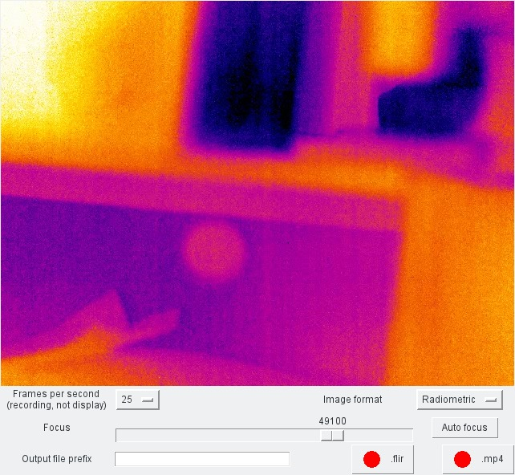

flir-recorder
=============

An interactive interface for FLIR GigE Vision thermal cameras (specifically an A645)

Dependencies
============

* Python 3
* NumPy
* PyGObject ( [https://pygobject.readthedocs.io/en/latest/](https://pygobject.readthedocs.io/en/latest/) )
* aravis ( [https://github.com/AravisProject/aravis](https://github.com/AravisProject/aravis) ) version 0.5.x or 0.6.x (it's possible 0.4.x will work with `0.6` changed to `0.4` in `record.py`; untested)

Optional dependencies
=====================

* Cython --- for building the more efficient colour-mapping code
* PyAV ( [https://github.com/mikeboers/PyAV](https://github.com/mikeboers/PyAV) ) --- for MP4 output

Building (optional: only for a more efficient colour-mapping implementation)
============================================================================

1. fix the paths in `PYTHON_INC` in `./Makefile` to correspond to your system's Python installation
2. type `make`

Running
=======

1. Type `python3 record.py`
2. Adjust settings as required.  The live display auto-ranges and only updates at 5Hz.
3. Recordings can be made.  Filenames will consist of a timestamp, appended to an optional user-provided prefix.
	a) .mp4 recordings will be the same as the live display, albeit at the full frame rate.
	b) .flir recordings will save raw data in the same format as the LabView programme.

If you later wish to transcode `FILENAME.flir` to auto-ranged MP4 format, run `python3 flir2mp4.py FILENAME.flir FRAMERATE` and `FILENAME.flir.mp4` will be produced.

Troubleshooting
===============

* Problem importing aravis (`ValueError: Namespace Aravis not available`): emend the setting of `GI_TYPELIB_PATH` in `record.py` to include wherever `Aravis-0.6.typelib` is installed.
* `No camera found`: ensure your computer's network firewall is not blocking discovery packets to the camera.

License
=======

GPLv2
